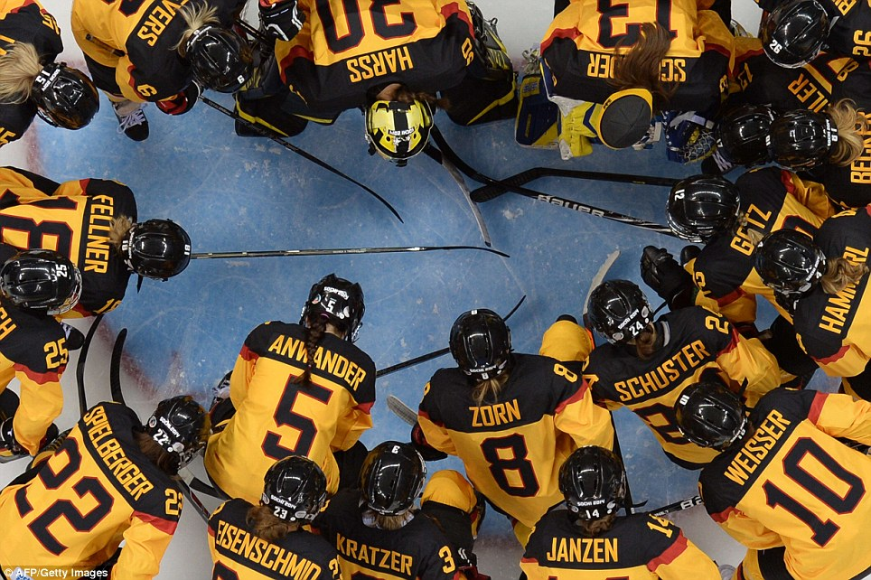

# Titre

## Cartouche d'identification

- Manifestation : CodeursEnSeine 2018
- Lieu : Kindarena Rouen
- Conférence : Management dans le sport
- Horaire de la conférence : 9 heures
- Durée de la conférence : 45 minutes
- Conférencier :
  - ([Guy Fournier](https://fr.wikipedia.org/wiki/Guy_Fournier_(hockey_sur_glace)))
- Audience : environ 250 personnes
- Auteur du billet : Assvin Tharmarajah
- Mots-clés :
  - Management
  - Sport 
  - Formation
  - Recrutement
  - Stratégie
  - Objectifs
  - Travail d'équipe
 - [URL de l'illustration](https://www.dailymail.co.uk/sport/article-2556692/Sport-images-day-Our-picture-editors-selection-Feb-11.html)  : 
 - Source : https://www.dailymail.co.uk/sport/

## Support
- Lien vers le support (diapos) présenté en conférence : **Non disponible**
- Nombre de diapos du support : environ 15
- Plan du support :
  - Présentation des Dragons de Rouen
  - Recrutement
  - Formation
  - Définition des objectifs
  - Stratégie
  - Travail d'équipe

## Résumé

La conférence a débuté par la présentation du conférencier Guy Fournier sur son expérience personnelle dans le domaine du sport et du management en tant qu'entraîneur de l'équipe de hockey sur glace de Rouen.

Il s'appuye sur cinq élements importants pour expliquer sa vision sur la vision du management d'une équipe sportive: le recrutement, la formation, la définition des objectifs, la stratégie et le travail d’équipe.

Le recrutement est la période de travail la plus importante. Le budget doit être consacré afin de recruter des joueurs talentueux qui pourront tirer l'équipe vers le haut. Il faut construire une équipe en fonction du besoin. Guy Fournier préfère les joueurs plus techniques qui proposent un bon jeu mais il lui faut également des joueurs complémentaires tels que des joueurs physiques. L'entraîneur doit ensuite les mettre dans les meilleures conditions pour que chacun puisse exploiter ses forces. Pour le recrutement, le réseau est très important, il faut avoir des contacts pour trouver les joueurs que l'équipe a besoin.

La formation donne beaucoup d'importance à la scolarité et encourage les joueurs à avoir un double projet sportif et scolaire. Des professeurs sont recrutés pour donner des cours. La notion de respect et discipline y sont très importantes.

Pour la définition des objectifs, Guy Fournier nous indique qu'il faut être ambitieux mais également réaliste.

La stratégie est également très importante. Il vaut mieux en avoir une mauvaise que de ne pas en avoir du tout. Il faut pouvoir synchroniser tous les joueurs sur une même chaîne. Pour y arriver, l'entraîneur doit être organisé, avoir un discours cohérent et avoir une valeur d'exemplarité.
D'autres notions sont également importantes telles que le partages de connaissances, la confiance et la communication car les joueurs doivent pouvoir s'exprimer.

Le travail d'équipe doit être pris en compte par l'entraîneur. Pour y parvenir il doit traiter les joueurs différemment car ils ont des parcours, des vies et des cultures différentes. Il faut pouvoir les rendre heureux pour qu'ils puissent donner le meilleur d'eux mêmes. Il faut également leur faire comprendre que le travail est important pour le succès de l'équipe.

Guy Fournier a comparé à de nombreuses reprises le management d'une équipe sportive à celle d'une équipe en entreprise. Les différents éléments dont il nous a parlé peuvent en effet être appliqué à toute entreprise.

## Architecture et facteur qualité

Cette conférence répond au besoin de revoir les méthodes de management mis en place afin d'augmenter les performances, la productivité, la qualité du travail en donnant de l'importance aux employés pour qu'ils soient heureux lors de leur travail.

